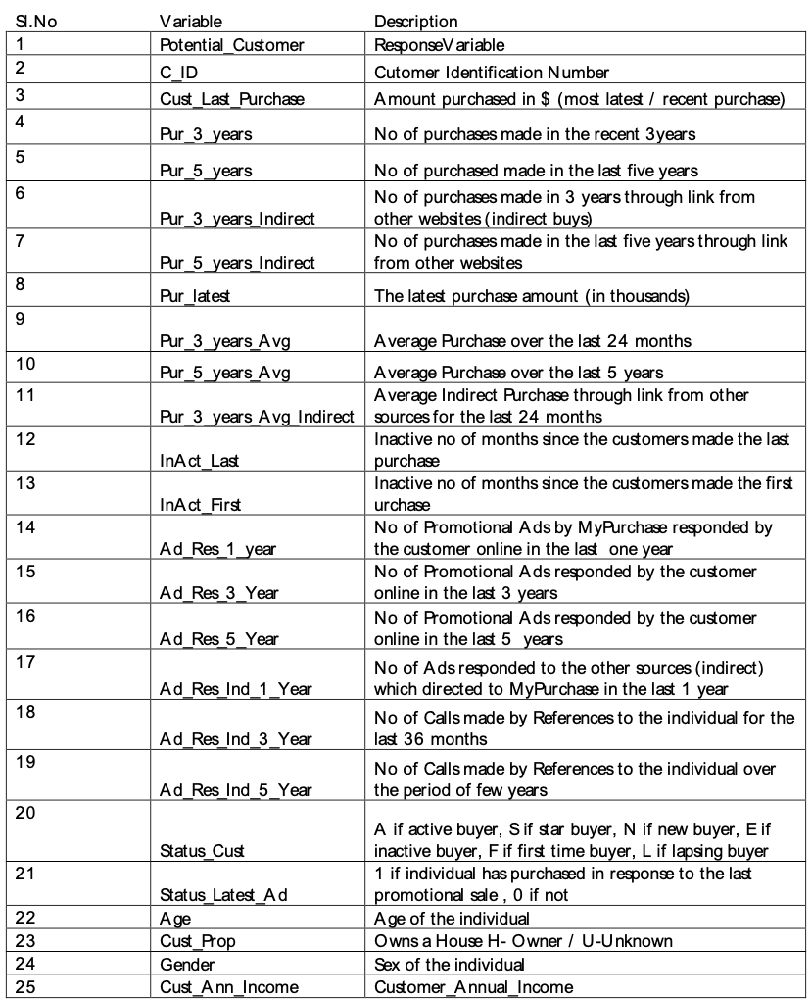

## JDS Cohort 2/2022 Capstone: Target Market Analysis

For the capstone, I was provided with information on customers' historical purchase records. For example, the dataset `data.csv` details information such
as the amount of money spent, number of inactive months, whether they made a purchase or not and so on.

The overall goal is to design a predictive model to determine potential customers who will make a purchase if you send them an advertisement.

## Objectives

1. Design a predictive model to determine potential customers that will make a purchase if we send them advertisement. The target variable here is `Potential_Customer`. 

## Data description

Below are the descriptions of each feature available in the dataset `data.csv`.

